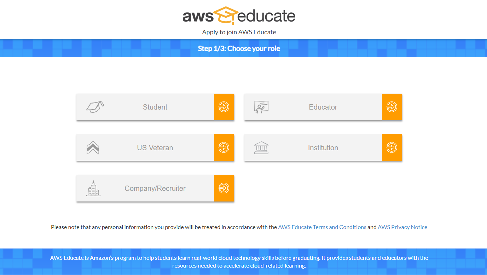
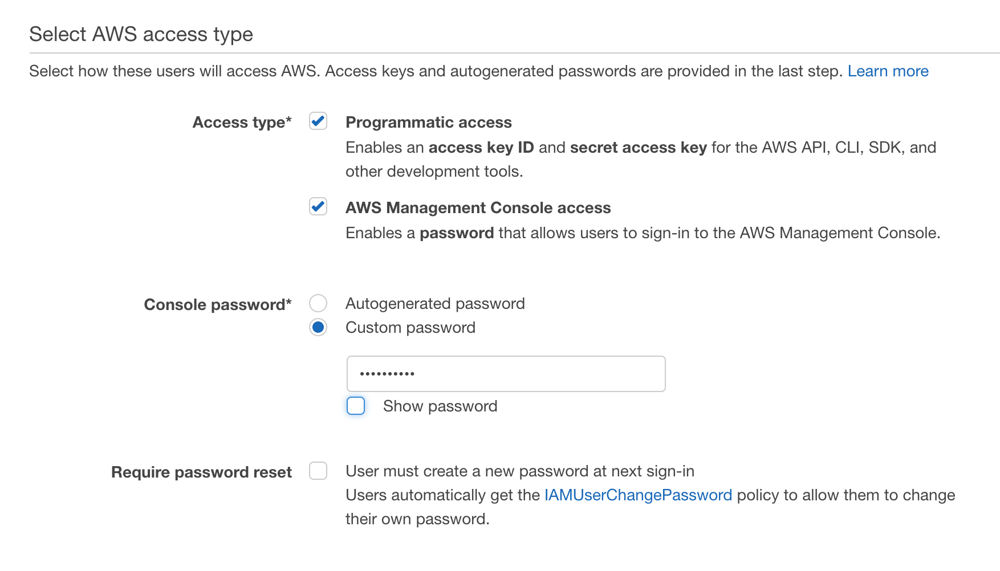
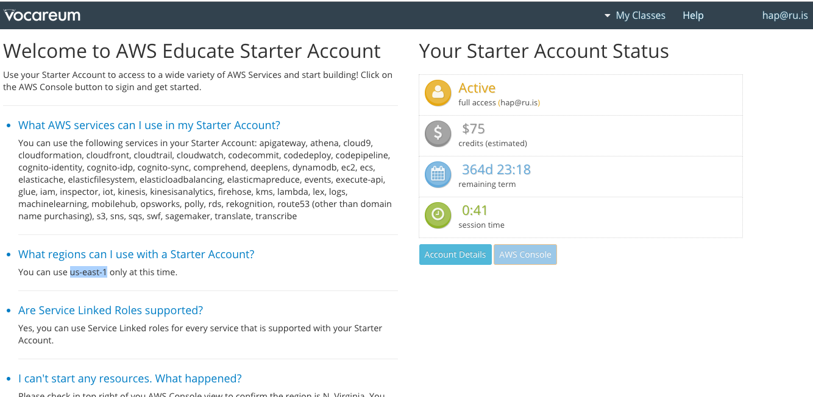

# Day 3 - Provision environment in AWS.

## Objectives

- To be able to run application on an AWS EC2 instance.

## Step 1 - Setting up a student account
Sign up for a student account on [AWS Educate] (https://aws.amazon.com/education/awseducate/)
Step 1: Select Join AWS Educate  
Step 2: Select Student 
Step 3. Fill out the following form 
Step 4. Select "Click here to select an AWS Educate Starter Account" 
Step 4. Wait for confirmation email from AWS, that can take 1-2 days.   
...

Step 5. You should get an email with the subject "AWS Educate Application Approved", follow the instructions in the email and check the following box in the sign up process:   

Step 6. In the final step you should see the following page:
  

## Step 2 - Getting started with Amazon Web Services

### Create a Key Pair

Set up your AWS account.
From the Vocareum page click on the AWS console.

Now inside the Console go to:\
`Services > EC2 > Network & Security > Key Pairs`\
Create a new Key Pair named `MyKeyPair`, we will use this key later to access our instance.\
So make sure to download it and store it at a safe location (not inside a public repository).\
If you lose it you can not access instances protected with it, but you can create a new key
and a new instance.

### Launching an Instance

Now go to:\
`Services > EC2 > Network & Security > Key Pairs`\
And launch an instance (use defaults if not specified):\
Select AMI: `Ubuntu Server 18.04 LTS (HVM), SSD Volume Type`\
Instance Type: `t2.micro`\
Name Security Group: `MySecurityGroup`\
Key Pair: `MyKeyPair`\
Launch instance.

You should now see a new instance in the console, wait until it's state turns
green.

Right click on your instance and click connect, follow the instructions to connect to your instance.

### Starting a Server
Login to the EC2 instance.
Create a index.html
```
echo "Hello, World" > index.html
```
Run the busybox webserver
```
nohup busybox httpd -f -p 8080 &
```

Now there is a server running inside your instance listening on port `8080`.\
Check if the server is running on the instance:
```bash
$ curl localhost:8080
Hello, World
```

Now check if the server is accessible through the internet:
```bash
$ curl http://<EC2_INSTANCE_PUBLIC_IP>:8080
# Command will timeout
```

The reason you can not connect to your instance is that port `8080` is not open, so the
request is not reaching the server. By default only port `22` is open since you need that
to manage your instance via SSH.

Now to open a port, go to:\
`Services > EC2 > Network & Security > Security Groups`\
Edit the security group for your instance, you need to add an inbound TCP rule to
allow traffic through port `8080` from anywhere.

Check if the server is running (this should output "Hello, World")
```
$ curl http://<EC2_INSTANCE_PUBLIC_IP>:8080
Hello, World
```

## Step 4 - Terminate instance

Terminate the instance you just created.

## Step 5 - Install AWS Cli

[Install AWS Cli](https://docs.aws.amazon.com/cli/latest/userguide/installing.html), once you are
done verify using:
```bash
aws --version
```

Also remember to add `aws` to the verify script you created in day 1.

### How do I know I'm done?

- [ ] I've created an account on AWS
- [ ] I have one AWS instance running
- [ ] I have a simple webserver running
- [ ] I can visit my AWS site using its public DNS, example
      `http://ec2-SOME-NUMBERS.us-west-2.compute.amazonaws.com/` and see my
      application running
- [ ] I have terminated the instance.
- [ ] I have AWS cli installed.
